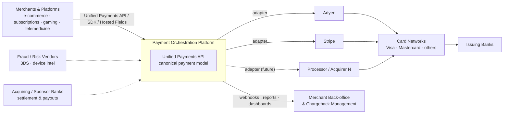
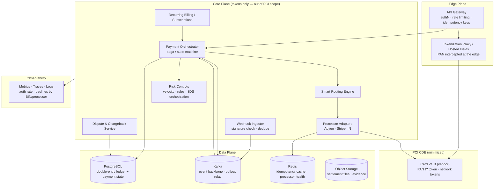
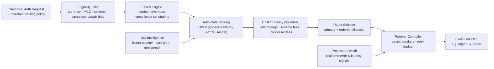
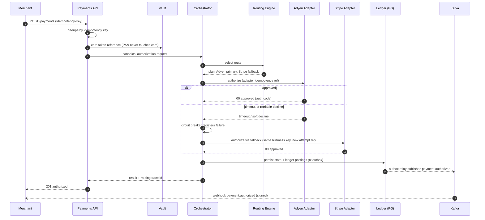
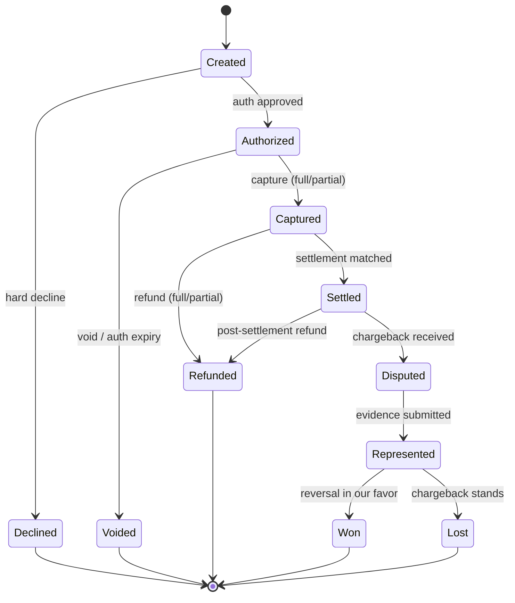
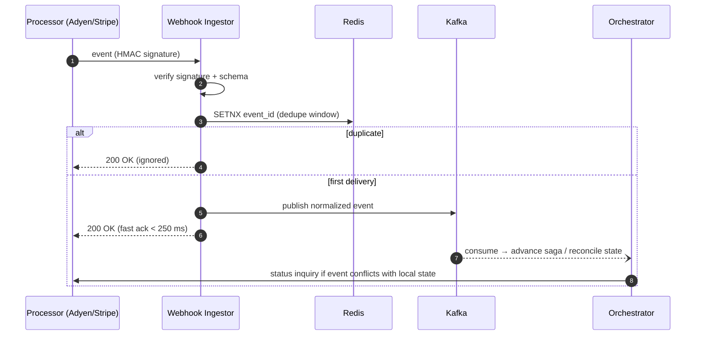
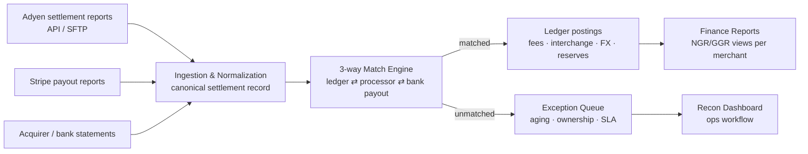
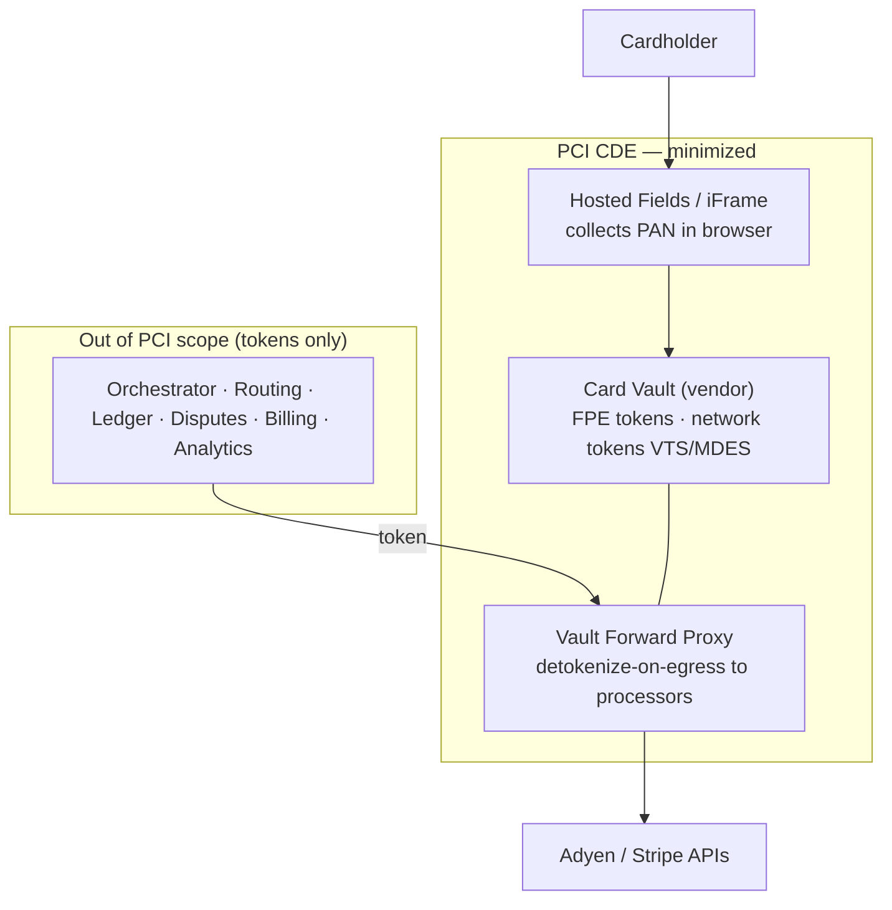
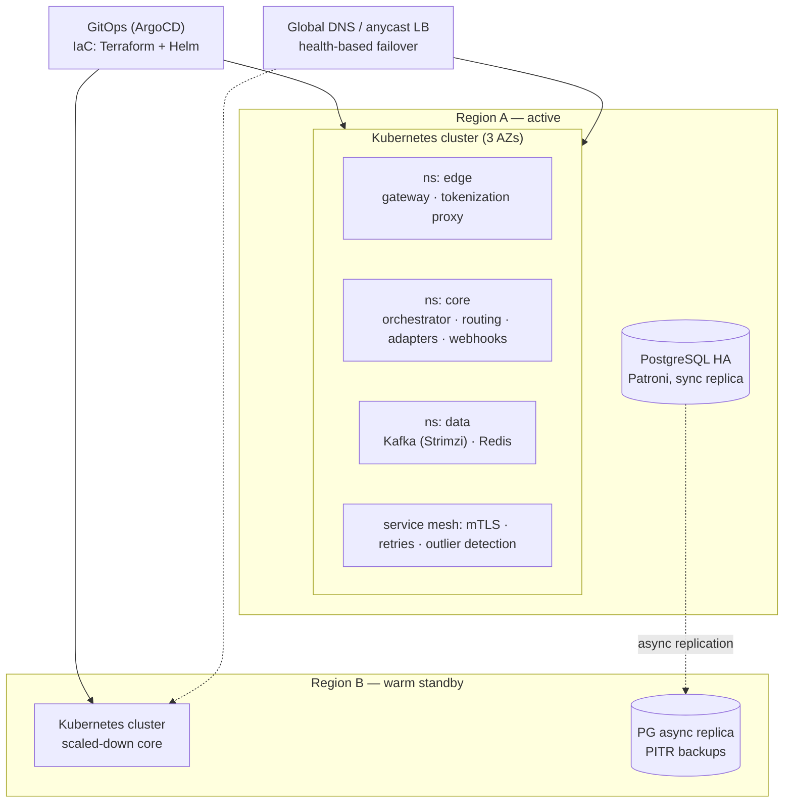

This is a lightly edited Architecture Review Board (ARB) document — the kind of artifact I use to make a high-stakes architecture decision reviewable, explainable and defensible before a single line of production code is written. I am publishing it because it shows how I connect technical decisions to business outcomes: the canonical model that turns "add a processor" from a project into an adapter, the routing engine that lifts authorization rates, the ledger that keeps money provably correct, and the PCI strategy that minimizes the most expensive compliance surface in the business. Reference identifiers (ARB number, processors) are illustrative; the reasoning, trade-offs and structure are exactly how I run this kind of review.

> **ARB-2026-001 · Status:** Proposed · **Scope:** Processor-agnostic payment orchestration layer between merchants, gateways, processors and acquiring banks. **Deciders:** CTO / Head of Engineering, Head of Risk, Head of Operations.

## 1. Executive Summary

The company processes payments for high-velocity and high-risk verticals (e-commerce, subscriptions, gaming, nutraceuticals, telemedicine, prop trading) and currently depends on direct, per-processor integrations. This ARB proposes a **processor-agnostic payment orchestration platform** that:

- Abstracts gateways/processors behind a **canonical payment model** (add or swap processors with zero merchant-facing change).
- Raises authorization rates via an **intelligent routing engine** (rules + failover in v1, data-driven scoring in v2) — target uplift of **+2–4 p.p.**
- Owns the **full payment lifecycle**: authorize, capture, void, refund, dispute, chargeback, settlement, reconciliation.
- Reduces **PCI DSS scope** through edge tokenization and a vault strategy that preserves card-data portability.
- Runs **cloud-agnostic on Kubernetes**, with no hard dependency on a single cloud provider's managed services.

Phase 1 integrates **Adyen** and **Stripe**; the architecture is designed so processor N+1 is an adapter, not a project.

## 2. Goals, Non-Goals & Quality Attributes

### Goals
1. Single unified Payments API for merchants (REST + webhooks + SDKs).
2. Transaction-level smart routing optimizing for auth rate, cost, latency, and risk tolerance.
3. Resilience by design: idempotency end-to-end, retries with budgets, circuit breakers per processor, graceful degradation.
4. Double-entry financial ledger as the internal source of truth; automated settlement reconciliation.
5. PCI DSS v4.0 compliance with aggressive scope reduction (tokenize at the edge; core services never see PANs).
6. Real-time payments observability: auth rate, decline reasons by BIN/processor, latency, processor health.

### Non-Goals (Phase 1)
- Building an in-house fraud ML platform (integrate/score via rules + vendor; revisit in Phase 3).
- Alternative payment methods (ACH, wallets, BNPL) — designed-for, not built in Phase 1.
- In-house card vault inside our own CDE (see ADR-003: buy first, build later if economics demand).
- Issuing, payouts-as-a-product, or treasury features.

### Quality Attributes (NFRs / SLOs)

| Attribute | Target | Notes |
|---|---|---|
| Availability (authorization path) | 99.99% | Multi-AZ; degraded-mode routing when a processor is down |
| Platform latency overhead | p99 ≤ 150 ms | Excludes processor/network time |
| End-to-end authorization | p99 ≤ 800 ms | Including processor round-trip |
| Throughput | 1,000 TPS sustained, burst 5,000 | Horizontally scalable stateless core |
| Durability (ledger) | RPO ≤ 5 min, RTO ≤ 30 min | Cross-region replicas + tested restore |
| Correctness | Zero double-charge invariant | Idempotency keys + transactional outbox |
| Compliance | PCI DSS v4.0 SAQ-D (service provider) | CDE minimized via tokenization proxy |
| Auditability | 100% of state transitions event-sourced | Immutable event log, 7-year retention |

## 3. System Context (C4 — Level 1)

**Reading:** merchants integrate once against the canonical API. Processors, acquirers, and risk vendors are pluggable edges. The platform is the system of record for payment state; processors are execution venues.

## 4. Container View (C4 — Level 2)

**Key property:** raw PANs exist only between Hosted Fields/Tokenization Proxy and the Vault. Every core service operates on tokens, keeping the orchestrator, ledger, and adapters out of CDE scope (detail-token forwarding to processors happens via the vault's forward-proxy).

## 5. Smart Routing Engine (C4 — Level 3)

Routing decisions are **deterministic and explainable**: every authorization stores the full decision trace (filters applied, scores, chosen route, fallbacks) for audit and for training the v2 scoring model.

## 6. Authorization Flow with Failover (sequence)

**Double-charge safety:** a fallback attempt is only issued when the first attempt is in a provably terminal or query-resolvable state (decline, timeout followed by status inquiry/void). Each external attempt carries its own processor idempotency reference under one business-level key.

## 7. Payment Lifecycle (state machine)

Every transition is an immutable event on Kafka (`payment.*`), consumed by ledger postings, merchant webhooks, analytics, and the chargeback-prevention layer.

## 8. Webhook Ingestion (idempotent, async)

## 9. Settlement & Reconciliation Pipeline

Reconciliation is **exception-driven**: matched volume flows straight through; humans only touch the exception queue. Targets: ≥ 99.5% auto-match rate, exceptions aged < 48h.

## 10. Security & PCI DSS Scope

| Control | Approach |
|---|---|
| Cardholder data | Never stored/processed/transmitted by core services; vendor vault + hosted fields (ADR-003) |
| Encryption | TLS 1.3 in transit; AES-256 at rest; mTLS service-to-service via mesh |
| Secrets | External secrets manager (HashiCorp Vault), short-lived credentials, no secrets in env files |
| Access | SSO + hardware MFA for CDE-adjacent systems; quarterly access review |
| Network tokens | Visa VTS / Mastercard MDES via vault provider — auth uplift + PAN lifecycle resilience |
| Fraud controls | Velocity checks, BIN/geo rules, 3DS2 orchestration (exemption logic per PSD2/SCA where applicable) |
| Audit | Immutable event log; QSA engagement from design phase (compliance-by-design) |

## 11. Deployment View — Cloud-Agnostic Kubernetes

Cloud-agnostic rules: only CNCF/portable building blocks in the critical path (Kubernetes, Strimzi Kafka, Patroni PostgreSQL, Redis, ArgoCD, Prometheus/Grafana/OpenTelemetry). Anything cloud-managed must sit behind an interface owned by us.

## 12. Architecture Decision Records

| ADR | Decision | Status |
|---|---|---|
| ADR-001 | Canonical payment model + hexagonal processor adapters | Proposed |
| ADR-002 | Event-driven core: Kafka + transactional outbox + orchestration saga | Proposed |
| ADR-003 | Tokenization: buy vendor vault now, network tokens next, no processor-locked vault | Proposed |
| ADR-004 | PostgreSQL double-entry ledger as financial source of truth | Proposed |
| ADR-005 | Kafka (Strimzi) over cloud-managed queues for portability | Proposed |
| ADR-006 | Routing v1 = rules + health-based failover; v2 = BIN×processor scoring | Proposed |
| ADR-007 | Idempotency & resilience contract (keys, retries, circuit breakers) | Proposed |
| ADR-008 | Cloud-agnostic Kubernetes + GitOps as the runtime standard | Proposed |

### ADR-001 — Canonical Payment Model & Gateway Abstraction
**Context:** merchant integrations must survive processor swaps; Adyen and Stripe differ in object models, webhooks, and edge cases.
**Decision:** define a processor-neutral canonical model (Payment, Attempt, Instrument, Dispute, Settlement); each processor is a hexagonal adapter translating canonical ⇄ native, owning its quirks (retries, idempotency semantics, webhook formats).
**Options considered:** (A) canonical model + adapters — chosen; (B) pass-through per-processor APIs — fast but couples merchants to processors, kills routing; (C) adopt one processor's model as internal standard — hidden lock-in.
**Consequences:** + processor N+1 becomes a bounded adapter project; + routing operates on one model. − canonical model is a design investment; lowest-common-denominator risk mitigated by typed `processor_extensions`.

### ADR-002 — Event-Driven Core (Outbox + Orchestration Saga)
**Context:** payment lifecycle spans async external systems; we need exactly-once *effects* over at-least-once delivery.
**Decision:** state changes commit to PostgreSQL with a transactional outbox; a relay publishes to Kafka; the payment lifecycle is an **orchestrated saga** (explicit state machine) rather than choreography.
**Options:** (A) orchestration saga — chosen (explainability, support tooling, auditability); (B) choreography — emergent behavior is hard to debug in money flows; (C) synchronous-only — no resilience story.
**Consequences:** + complete audit trail, replayable; + webhooks and retries converge on one state machine. − consumers must be idempotent; outbox relay is critical infrastructure (monitored, HA).

### ADR-003 — Tokenization & Vault Strategy
**Context:** PCI scope is the largest compliance cost; vault portability decides whether we can ever switch processors freely.
**Decision:** Phase 1 — vendor vault (VGS / Basis Theory class) with hosted fields + forward proxy: minimal CDE, fast time-to-market, **we own the tokens**. Phase 2 — network tokens (VTS/MDES) for auth uplift and card-lifecycle resilience. Explicitly avoid storing cards only inside Adyen/Stripe vaults.
**Options:** (A) vendor vault — chosen; (B) build in-house CDE vault — full control, but 6–12 months and heavy PCI burden before any merchant value; (C) processor vaults — zero effort, maximal lock-in (migration requires PAN export programs).
**Consequences:** + SAQ scope minimized; + portability preserved. − per-token vendor cost (revisit build-vs-buy at scale ≥ N million tokens); vendor availability is now in the critical path → contractually bounded SLA + dual-write escape plan documented.

### ADR-004 — PostgreSQL Double-Entry Ledger
**Context:** financial correctness requires balanced, immutable postings (merchant balance, fees, reserves, refunds, chargebacks).
**Decision:** PostgreSQL with append-only double-entry postings; balances are derived, never mutated; strict serializable transactions on money paths.
**Options:** (A) PostgreSQL — chosen (team proficiency, SQL analytics, Patroni HA, boring technology); (B) purpose-built ledger DB (TigerBeetle) — compelling at extreme TPS, revisit if > 10k postings/s; (C) NoSQL — weak fit for relational financial integrity.
**Consequences:** + auditable by construction; + finance/BI can query directly. − partitioning/archival strategy required from day one (monthly partitions, cold storage to object store).

### ADR-005 — Kafka (Strimzi) as Event Backbone
**Context:** cloud-agnostic constraint (this ARB) excludes SQS/PubSub as primary backbone.
**Decision:** Kafka via Strimzi operator on Kubernetes; schema registry with versioned Avro/JSON-Schema contracts; compacted topics for state snapshots.
**Options:** (A) Strimzi Kafka — chosen; (B) Redpanda — Kafka-compatible, lower ops surface, kept as drop-in alternative; (C) RabbitMQ — weaker replay/event-sourcing fit; (D) cloud-managed — violates portability constraint.
**Consequences:** + replay, audit, stream analytics. − Kafka ops burden owned by us → mitigate with operator, SLOs, and a tested upgrade runbook.

### ADR-006 — Routing Strategy (Rules First, Scoring Second)
**Context:** routing is the product's core value, but ML on day one without data is fiction.
**Decision:** v1 ships a deterministic rules engine (merchant policy, eligibility, cost ranking) + health-based failover, while logging full decision traces. v2 trains BIN×processor×time auth-rate scoring on our own traces; v3 explores contextual bandits for exploration/exploitation.
**Consequences:** + explainable from day one (merchants and risk teams can read the trace); + the data needed for v2 is produced by v1 as a by-product. − uplift in v1 comes mostly from failover and cost ranking, not prediction — set expectations accordingly.

### ADR-007 — Idempotency & Resilience Contract
**Decision:** (1) merchant-facing `Idempotency-Key` required on all mutating endpoints, replay returns the original result; (2) one business key → many attempt references, each attempt carries a unique processor idempotency token; (3) circuit breakers per processor *and* per processor×BIN-range; (4) retry budgets with jittered backoff, no retry on hard declines (network rules); (5) timeout policy: inquire-then-void before any fallback attempt; (6) graceful degradation: if routing engine is down, fall back to static merchant-default processor.
**Consequences:** the zero-double-charge invariant becomes testable — chaos tests and fault-injection suites assert it in CI.

### ADR-008 — Cloud-Agnostic Kubernetes Runtime
**Decision:** Kubernetes + Helm + ArgoCD GitOps; Terraform for infra; OpenTelemetry-native observability (Prometheus, Grafana, Loki/Tempo); HashiCorp Vault for secrets; service mesh for mTLS and outlier detection. Managed cloud services allowed only behind owned interfaces and never as the only implementation in the critical payment path.
**Consequences:** + credible multi-cloud / on-prem story for acquiring partners with data-residency demands. − we own more operational surface → SRE practices (below) are not optional.

## 13. Observability & Operations

**Golden signals (payments-specific):**
- Authorization rate (global, per merchant, per processor, per BIN/issuer-country) — 5-min and daily windows.
- Decline taxonomy: hard vs soft vs fraud vs technical, mapped to canonical decline codes.
- Routing efficacy: uplift of chosen route vs counterfactual baseline; failover frequency.
- Latency: platform overhead vs processor round-trip, per adapter.
- Money integrity: ledger balance checks, outbox lag, reconciliation auto-match %, exception aging.

**Operational practice:** SLO-based alerting (burn rates), per-processor health dashboards, runbooks per failure class (processor brownout, webhook storm, vault degradation, Kafka partition lag), on-call rotation with payments-specific escalation (risk/ops bridge), weekly auth-rate review with business.

## 14. Risks & Open Questions (require business decision)

| # | Open point | Why it matters | Recommendation |
|---|---|---|---|
| 1 | PayFac vs ISO/MSP operating model | Changes funds-flow, ledger design (for-benefit-of accounts), and compliance burden | Decide before ledger schema freeze |
| 2 | 3DS strategy: processor-native vs standalone 3DS server | Standalone keeps 3DS portable across processors | Standalone preferred; validate cost |
| 3 | Fraud: build rules-only vs vendor (Forter/Sift class) | High-risk verticals → chargeback ratios threaten scheme programs (VAMP) | Vendor + in-house velocity rules hybrid |
| 4 | Vault vendor selection (VGS vs Basis Theory vs other) | SLA, latency, network-token support, pricing at scale | Run a 2-week PoC with both |
| 5 | Data residency requirements from acquirers/sponsor banks | May force region pinning and influence Region B placement | Survey partner contracts now |
| 6 | Multi-currency / FX handling in ledger | Affects posting model and reconciliation matching | Model currencies from day one even if single-currency at launch |
| 7 | Chargeback alerts (Ethoca/Verifi) integration timing | Directly reduces dispute losses for high-risk merchants | Phase 2 candidate, high ROI |

## 15. Phased Roadmap

| Phase | Scope | Exit criteria |
|---|---|---|
| **0 — Foundations (wks 1–6)** | K8s + GitOps + observability baseline; canonical model; ledger schema; vault vendor PoC | ADRs 001–008 ratified; walking skeleton authorizes a test card end-to-end |
| **1 — MVP (wks 6–16)** | Adyen + Stripe adapters; auth/capture/void/refund; idempotency contract; webhook ingestion; static + failover routing; merchant dashboard v0 | First merchant live; zero-double-charge chaos suite green; SAQ scope validated with QSA |
| **2 — Orchestration value (wks 16–28)** | Cost/eligibility routing; settlement ingestion + 3-way recon; disputes/chargeback service; network tokens; recurring billing | ≥ 99.5% auto-match; measured auth-rate uplift vs baseline |
| **3 — Scale & intelligence (wks 28+)** | Scoring-based routing (v2); fraud vendor integration; processor N+1; Region B warm standby; APM expansion (wallets/ACH) | 5k TPS load test; regional failover drill ≤ RTO |

---

*Why I publish this: an ARB like this is where engineering leadership actually happens — making the cost, risk and portability trade-offs explicit before the build, so the team moves fast without betting the business on a decision nobody can later explain. Glossary (FTD, NGR/GGR, interchange, MTI/ISO 8583, SCA, VAMP) available on request.*
