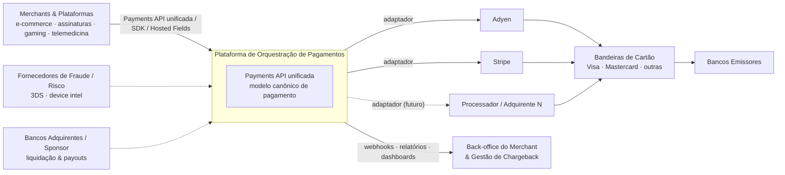
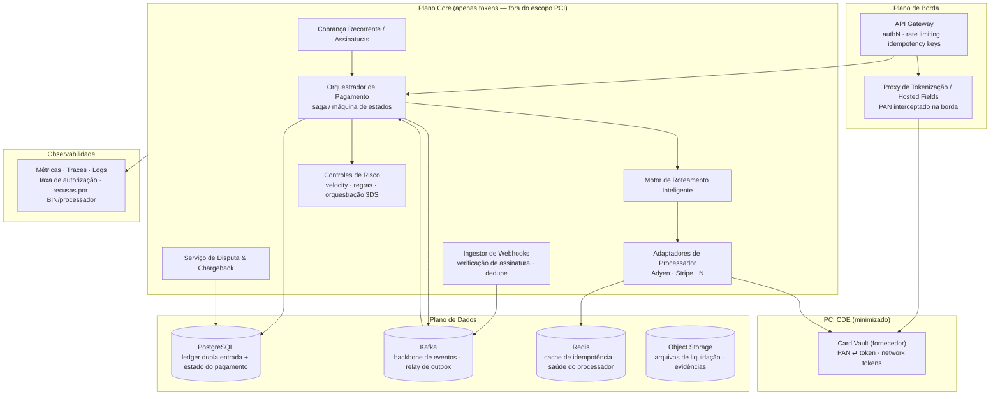
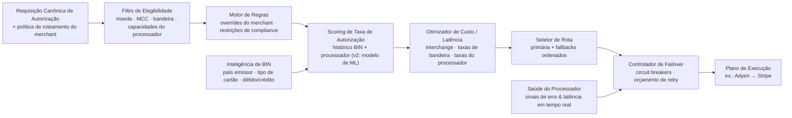
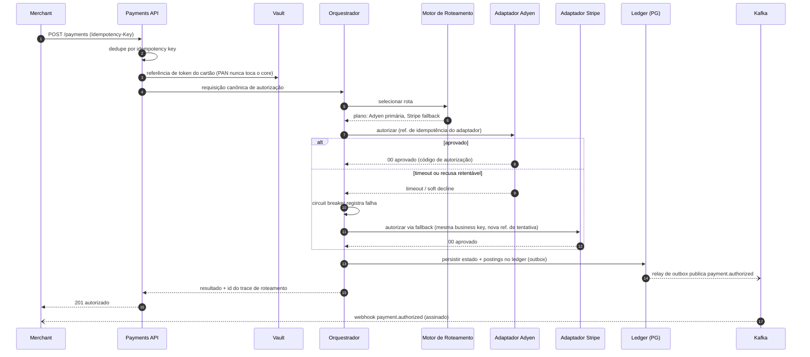
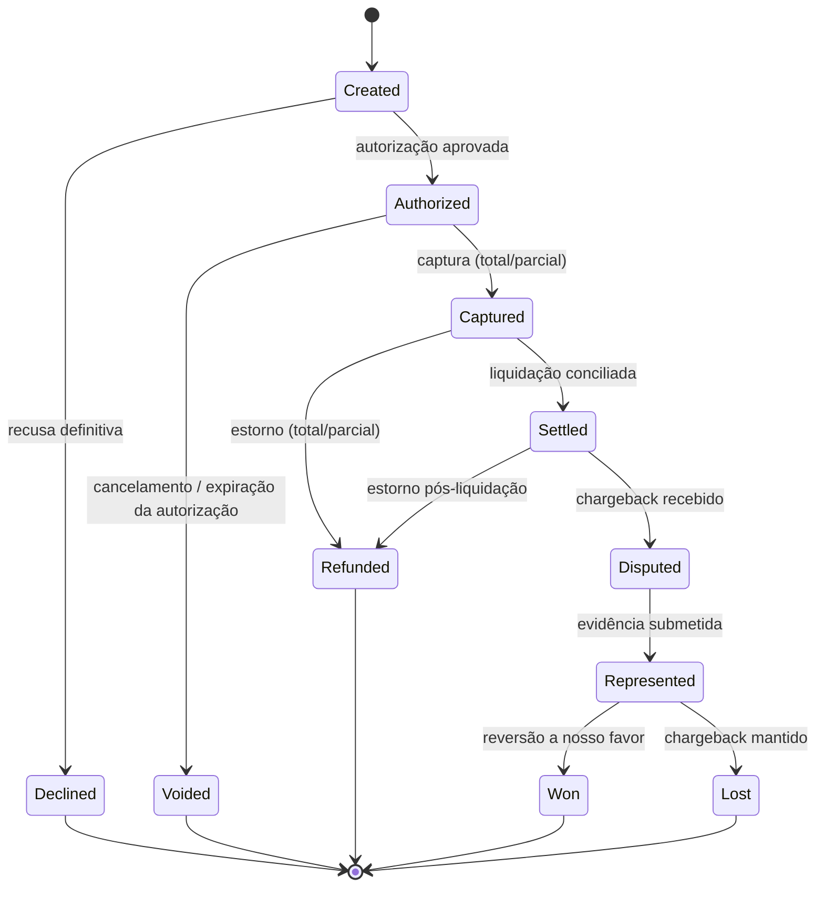
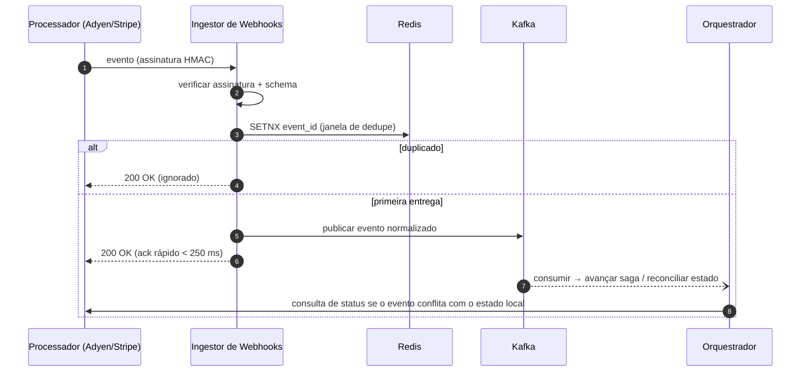
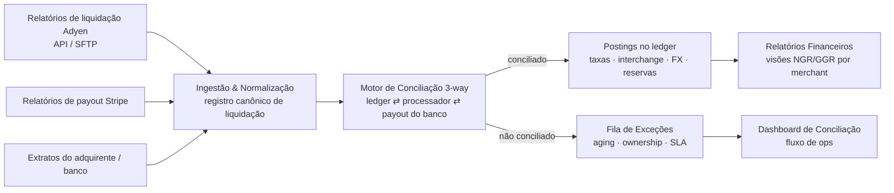
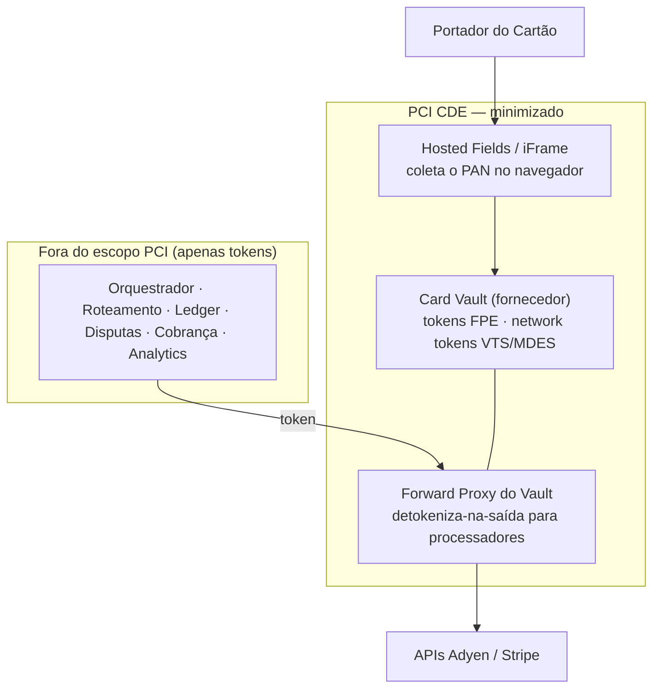
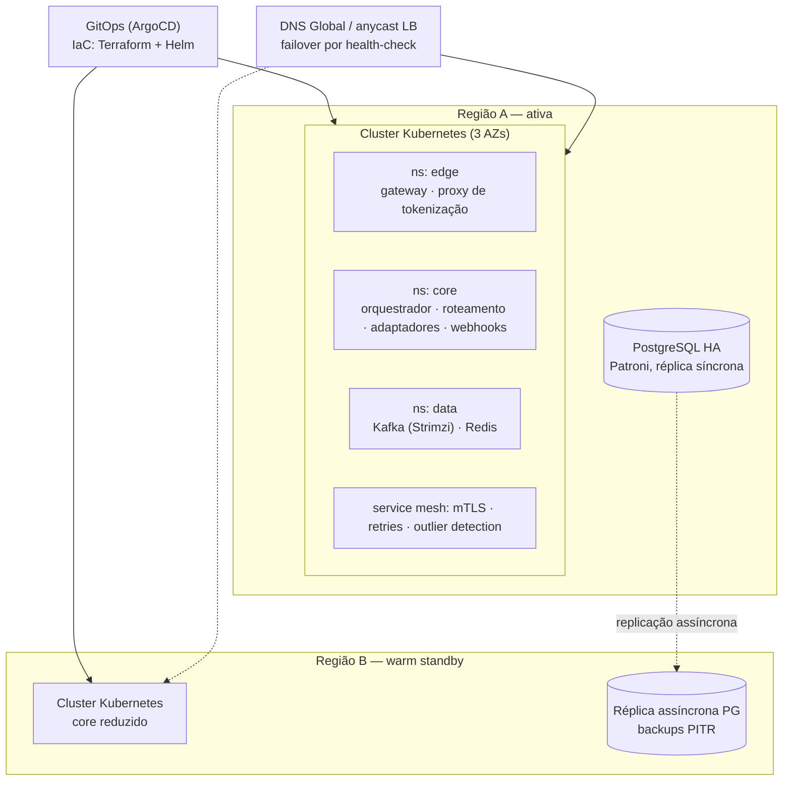

Este é um documento de Architecture Review Board (ARB) levemente editado — o tipo de artefato que uso para tornar uma decisão de arquitetura de alto impacto revisável, explicável e defensável antes de escrever uma linha de código em produção. Publico porque ele mostra como conecto decisões técnicas a resultado de negócio: o modelo canônico que transforma "adicionar um processador" de projeto em adaptador, o motor de roteamento que eleva a taxa de autorização, o ledger que mantém o dinheiro comprovadamente correto e a estratégia PCI que minimiza a superfície de compliance mais cara do negócio. Identificadores de referência (número do ARB, processadores) são ilustrativos; o raciocínio, os trade-offs e a estrutura são exatamente como conduzo esse tipo de revisão.

> **ARB-2026-001 · Status:** Proposto · **Escopo:** Camada de orquestração de pagamentos agnóstica a processador entre merchants, gateways, processadores e bancos adquirentes. **Decisores:** CTO / Head of Engineering, Head of Risk, Head of Operations.

## 1. Resumo Executivo

A empresa processa pagamentos para verticais de alto volume e alto risco (e-commerce, assinaturas, gaming, nutracêuticos, telemedicina, prop trading) e hoje depende de integrações diretas, uma por processador. Este ARB propõe uma **plataforma de orquestração de pagamentos agnóstica a processador** que:

- Abstrai gateways/processadores atrás de um **modelo canônico de pagamento** (adicionar ou trocar processadores sem nenhuma mudança visível ao merchant).
- Eleva taxas de autorização via um **motor de roteamento inteligente** (regras + failover na v1, scoring orientado a dados na v2) — ganho-alvo de **+2 a 4 p.p.**
- Detém todo o **ciclo de vida do pagamento**: autorizar, capturar, cancelar, estornar, contestar, chargeback, liquidação, conciliação.
- Reduz o **escopo PCI DSS** via tokenização na borda e uma estratégia de vault que preserva a portabilidade dos dados de cartão.
- Roda **cloud-agnóstico em Kubernetes**, sem dependência rígida dos serviços gerenciados de um único provedor de nuvem.

A Fase 1 integra **Adyen** e **Stripe**; a arquitetura é desenhada para que o processador N+1 seja um adaptador, não um projeto.

## 2. Objetivos, Não-Objetivos e Atributos de Qualidade

### Objetivos
1. Uma única Payments API unificada para merchants (REST + webhooks + SDKs).
2. Roteamento inteligente por transação, otimizando taxa de autorização, custo, latência e tolerância a risco.
3. Resiliência por design: idempotência ponta a ponta, retries com orçamento, circuit breakers por processador, degradação graciosa.
4. Ledger financeiro de dupla entrada como fonte da verdade interna; conciliação de liquidação automatizada.
5. Conformidade PCI DSS v4.0 com redução agressiva de escopo (tokenizar na borda; serviços core nunca veem PANs).
6. Observabilidade de pagamentos em tempo real: taxa de autorização, motivos de recusa por BIN/processador, latência, saúde do processador.

### Não-Objetivos (Fase 1)
- Construir uma plataforma de ML antifraude in-house (integrar/pontuar via regras + fornecedor; revisitar na Fase 3).
- Métodos de pagamento alternativos (ACH, carteiras, BNPL) — previstos em design, não construídos na Fase 1.
- Vault de cartão in-house dentro do nosso próprio CDE (ver ADR-003: comprar primeiro, construir depois se a economia exigir).
- Issuing, payouts-as-a-product ou funcionalidades de tesouraria.

### Atributos de Qualidade (NFRs / SLOs)

| Atributo | Meta | Notas |
|---|---|---|
| Disponibilidade (caminho de autorização) | 99,99% | Multi-AZ; roteamento em modo degradado quando um processador cai |
| Overhead de latência da plataforma | p99 ≤ 150 ms | Exclui tempo de processador/rede |
| Autorização ponta a ponta | p99 ≤ 800 ms | Incluindo round-trip do processador |
| Throughput | 1.000 TPS sustentados, burst de 5.000 | Core stateless escalável horizontalmente |
| Durabilidade (ledger) | RPO ≤ 5 min, RTO ≤ 30 min | Réplicas cross-region + restore testado |
| Correção | Invariante de zero cobrança dupla | Idempotency keys + outbox transacional |
| Compliance | PCI DSS v4.0 SAQ-D (service provider) | CDE minimizado via proxy de tokenização |
| Auditabilidade | 100% das transições de estado em event-sourcing | Log de eventos imutável, retenção de 7 anos |

## 3. Contexto do Sistema (C4 — Nível 1)

**Leitura:** o merchant integra uma vez contra a API canônica. Processadores, adquirentes e fornecedores de risco são bordas plugáveis. A plataforma é o sistema de registro do estado do pagamento; processadores são apenas locais de execução.

## 4. Visão de Containers (C4 — Nível 2)

**Propriedade-chave:** PANs em claro existem apenas entre Hosted Fields/Proxy de Tokenização e o Vault. Todo serviço core opera sobre tokens, mantendo orquestrador, ledger e adaptadores fora do escopo de CDE (o encaminhamento do token de detalhe ao processador acontece via forward-proxy do vault).

## 5. Motor de Roteamento Inteligente (C4 — Nível 3)

As decisões de roteamento são **determinísticas e explicáveis**: toda autorização armazena o trace completo da decisão (filtros aplicados, scores, rota escolhida, fallbacks) para auditoria e para treinar o modelo de scoring da v2.

## 6. Fluxo de Autorização com Failover (sequência)

**Segurança contra cobrança dupla:** uma tentativa de fallback só é emitida quando a primeira está em estado comprovadamente terminal ou resolvível por consulta (recusa, timeout seguido de consulta de status/cancelamento). Cada tentativa externa carrega sua própria referência de idempotência do processador, sob uma única chave de negócio.

## 7. Ciclo de Vida do Pagamento (máquina de estados)

Toda transição é um evento imutável no Kafka (`payment.*`), consumido por postings do ledger, webhooks do merchant, analytics e a camada de prevenção de chargeback.

## 8. Ingestão de Webhooks (idempotente, assíncrona)

## 9. Pipeline de Liquidação & Conciliação

A conciliação é **orientada a exceções**: o volume conciliado flui direto; humanos só tocam a fila de exceções. Metas: ≥ 99,5% de auto-match, exceções com aging < 48h.

## 10. Segurança & Escopo PCI DSS

| Controle | Abordagem |
|---|---|
| Dados do portador | Nunca armazenados/processados/transmitidos pelos serviços core; vault de fornecedor + hosted fields (ADR-003) |
| Criptografia | TLS 1.3 em trânsito; AES-256 em repouso; mTLS serviço-a-serviço via mesh |
| Segredos | Gerenciador externo de segredos (HashiCorp Vault), credenciais de vida curta, sem segredos em arquivos de env |
| Acesso | SSO + MFA por hardware para sistemas adjacentes ao CDE; revisão de acesso trimestral |
| Network tokens | Visa VTS / Mastercard MDES via provedor de vault — ganho de autorização + resiliência do ciclo de vida do PAN |
| Controles de fraude | Velocity checks, regras de BIN/geo, orquestração 3DS2 (lógica de isenção por PSD2/SCA quando aplicável) |
| Auditoria | Log de eventos imutável; engajamento de QSA desde a fase de design (compliance-by-design) |

## 11. Visão de Implantação — Kubernetes Cloud-Agnóstico

Regras cloud-agnósticas: somente blocos CNCF/portáveis no caminho crítico (Kubernetes, Strimzi Kafka, Patroni PostgreSQL, Redis, ArgoCD, Prometheus/Grafana/OpenTelemetry). Qualquer serviço gerenciado de nuvem deve ficar atrás de uma interface que nós controlamos.

## 12. Architecture Decision Records

| ADR | Decisão | Status |
|---|---|---|
| ADR-001 | Modelo canônico de pagamento + adaptadores hexagonais de processador | Proposto |
| ADR-002 | Core event-driven: Kafka + outbox transacional + saga de orquestração | Proposto |
| ADR-003 | Tokenização: comprar vault de fornecedor agora, network tokens depois, sem vault travado em processador | Proposto |
| ADR-004 | Ledger PostgreSQL de dupla entrada como fonte da verdade financeira | Proposto |
| ADR-005 | Kafka (Strimzi) em vez de filas gerenciadas, por portabilidade | Proposto |
| ADR-006 | Roteamento v1 = regras + failover por saúde; v2 = scoring BIN×processador | Proposto |
| ADR-007 | Contrato de idempotência & resiliência (keys, retries, circuit breakers) | Proposto |
| ADR-008 | Kubernetes cloud-agnóstico + GitOps como padrão de runtime | Proposto |

### ADR-001 — Modelo Canônico de Pagamento & Abstração de Gateway
**Contexto:** integrações de merchant precisam sobreviver a trocas de processador; Adyen e Stripe diferem em modelos de objeto, webhooks e casos de borda.
**Decisão:** definir um modelo canônico neutro a processador (Payment, Attempt, Instrument, Dispute, Settlement); cada processador é um adaptador hexagonal que traduz canônico ⇄ nativo, dono das suas idiossincrasias (retries, semântica de idempotência, formatos de webhook).
**Opções consideradas:** (A) modelo canônico + adaptadores — escolhida; (B) pass-through das APIs por processador — rápido, mas acopla merchants aos processadores e mata o roteamento; (C) adotar o modelo de um processador como padrão interno — lock-in disfarçado.
**Consequências:** + processador N+1 vira um projeto de adaptador delimitado; + roteamento opera sobre um único modelo. − o modelo canônico é um investimento de design; risco de menor-denominador-comum mitigado por `processor_extensions` tipados.

### ADR-002 — Core Event-Driven (Outbox + Saga de Orquestração)
**Contexto:** o ciclo de vida do pagamento atravessa sistemas externos assíncronos; precisamos de *efeitos* exactly-once sobre entrega at-least-once.
**Decisão:** mudanças de estado commitam no PostgreSQL com outbox transacional; um relay publica no Kafka; o ciclo de vida é uma **saga orquestrada** (máquina de estados explícita), não coreografia.
**Opções:** (A) saga de orquestração — escolhida (explicabilidade, tooling de suporte, auditabilidade); (B) coreografia — comportamento emergente é difícil de depurar em fluxos de dinheiro; (C) síncrono apenas — sem história de resiliência.
**Consequências:** + trilha de auditoria completa, replayável; + webhooks e retries convergem em uma máquina de estados. − consumidores precisam ser idempotentes; o relay de outbox é infraestrutura crítica (monitorada, HA).

### ADR-003 — Estratégia de Tokenização & Vault
**Contexto:** o escopo PCI é o maior custo de compliance; a portabilidade do vault decide se algum dia poderemos trocar de processador livremente.
**Decisão:** Fase 1 — vault de fornecedor (classe VGS / Basis Theory) com hosted fields + forward proxy: CDE mínimo, time-to-market rápido, **os tokens são nossos**. Fase 2 — network tokens (VTS/MDES) para ganho de autorização e resiliência do ciclo de vida do cartão. Evitar explicitamente guardar cartões apenas dentro dos vaults da Adyen/Stripe.
**Opções:** (A) vault de fornecedor — escolhida; (B) construir vault CDE in-house — controle total, mas 6–12 meses e pesado fardo PCI antes de qualquer valor ao merchant; (C) vaults dos processadores — esforço zero, lock-in máximo (migração exige programas de exportação de PAN).
**Consequências:** + escopo SAQ minimizado; + portabilidade preservada. − custo por token do fornecedor (revisitar build-vs-buy em escala ≥ N milhões de tokens); a disponibilidade do fornecedor entra no caminho crítico → SLA contratualmente limitado + plano de escape com dual-write documentado.

### ADR-004 — Ledger de Dupla Entrada em PostgreSQL
**Contexto:** correção financeira exige postings balanceados e imutáveis (saldo do merchant, taxas, reservas, estornos, chargebacks).
**Decisão:** PostgreSQL com postings de dupla entrada append-only; saldos são derivados, nunca mutados; transações serializáveis estritas nos caminhos de dinheiro.
**Opções:** (A) PostgreSQL — escolhida (proficiência do time, analytics SQL, HA com Patroni, tecnologia "chata"); (B) ledger DB dedicado (TigerBeetle) — atraente em TPS extremo, revisitar se > 10k postings/s; (C) NoSQL — fraco para integridade financeira relacional.
**Consequências:** + auditável por construção; + finanças/BI consultam direto. − estratégia de particionamento/arquivamento necessária desde o dia um (partições mensais, cold storage em object store).

### ADR-005 — Kafka (Strimzi) como Backbone de Eventos
**Contexto:** a restrição cloud-agnóstica (deste ARB) exclui SQS/PubSub como backbone primário.
**Decisão:** Kafka via operator Strimzi no Kubernetes; schema registry com contratos Avro/JSON-Schema versionados; tópicos compactados para snapshots de estado.
**Opções:** (A) Strimzi Kafka — escolhida; (B) Redpanda — compatível com Kafka, menor superfície de ops, mantido como alternativa drop-in; (C) RabbitMQ — pior fit para replay/event-sourcing; (D) gerenciado de nuvem — viola a restrição de portabilidade.
**Consequências:** + replay, auditoria, stream analytics. − o fardo de ops do Kafka é nosso → mitigar com operator, SLOs e runbook de upgrade testado.

### ADR-006 — Estratégia de Roteamento (Regras Primeiro, Scoring Depois)
**Contexto:** o roteamento é o valor central do produto, mas ML no dia um sem dados é ficção.
**Decisão:** a v1 entrega um motor de regras determinístico (política do merchant, elegibilidade, ranking de custo) + failover por saúde, registrando o trace completo das decisões. A v2 treina scoring de taxa de autorização BIN×processador×tempo sobre os nossos próprios traces; a v3 explora contextual bandits para exploração/explotação.
**Consequências:** + explicável desde o dia um (merchants e times de risco leem o trace); + os dados necessários para a v2 são produzidos pela v1 como subproduto. − o ganho na v1 vem majoritariamente de failover e ranking de custo, não de predição — alinhar expectativas.

### ADR-007 — Contrato de Idempotência & Resiliência
**Decisão:** (1) `Idempotency-Key` obrigatória em todos os endpoints mutáveis voltados ao merchant, replay retorna o resultado original; (2) uma business key → muitas referências de tentativa, cada tentativa carrega um token de idempotência único do processador; (3) circuit breakers por processador *e* por processador×faixa-de-BIN; (4) orçamentos de retry com backoff com jitter, sem retry em recusas definitivas (regras de bandeira); (5) política de timeout: consultar-então-cancelar antes de qualquer fallback; (6) degradação graciosa: se o motor de roteamento cair, recorrer ao processador-default estático do merchant.
**Consequências:** o invariante de zero cobrança dupla torna-se testável — suítes de chaos e fault-injection o asseguram em CI.

### ADR-008 — Runtime Kubernetes Cloud-Agnóstico
**Decisão:** Kubernetes + Helm + GitOps com ArgoCD; Terraform para infra; observabilidade OpenTelemetry-native (Prometheus, Grafana, Loki/Tempo); HashiCorp Vault para segredos; service mesh para mTLS e outlier detection. Serviços gerenciados de nuvem permitidos apenas atrás de interfaces que controlamos e nunca como a única implementação no caminho crítico do pagamento.
**Consequências:** + história crível de multi-cloud / on-prem para parceiros adquirentes com exigências de residência de dados. − assumimos mais superfície operacional → práticas de SRE (abaixo) não são opcionais.

## 13. Observabilidade & Operações

**Golden signals (específicos de pagamentos):**
- Taxa de autorização (global, por merchant, por processador, por BIN/país emissor) — janelas de 5 min e diária.
- Taxonomia de recusa: definitiva vs soft vs fraude vs técnica, mapeada para códigos canônicos de recusa.
- Eficácia de roteamento: ganho da rota escolhida vs baseline contrafactual; frequência de failover.
- Latência: overhead da plataforma vs round-trip do processador, por adaptador.
- Integridade do dinheiro: checagens de saldo do ledger, lag do outbox, % de auto-match da conciliação, aging de exceções.

**Prática operacional:** alerta baseado em SLO (burn rates), dashboards de saúde por processador, runbooks por classe de falha (brownout de processador, tempestade de webhooks, degradação de vault, lag de partição Kafka), rodízio de on-call com escalonamento específico de pagamentos (ponte risco/ops), revisão semanal de taxa de autorização com o negócio.

## 14. Riscos & Questões em Aberto (exigem decisão de negócio)

| # | Ponto em aberto | Por que importa | Recomendação |
|---|---|---|---|
| 1 | Modelo operacional PayFac vs ISO/MSP | Muda o funds-flow, o design do ledger (contas for-benefit-of) e o fardo de compliance | Decidir antes de congelar o schema do ledger |
| 2 | Estratégia 3DS: nativa do processador vs servidor 3DS standalone | Standalone mantém o 3DS portável entre processadores | Standalone preferido; validar custo |
| 3 | Fraude: só regras vs fornecedor (classe Forter/Sift) | Verticais de alto risco → taxas de chargeback ameaçam programas de bandeira (VAMP) | Híbrido: fornecedor + regras de velocity in-house |
| 4 | Seleção do fornecedor de vault (VGS vs Basis Theory vs outro) | SLA, latência, suporte a network token, preço em escala | Rodar PoC de 2 semanas com os dois |
| 5 | Exigências de residência de dados de adquirentes/bancos sponsor | Pode forçar fixação de região e influenciar a Região B | Levantar contratos de parceiros agora |
| 6 | Multi-moeda / tratamento de FX no ledger | Afeta o modelo de postings e o matching de conciliação | Modelar moedas desde o dia um, mesmo se mono-moeda no lançamento |
| 7 | Timing de integração de alertas de chargeback (Ethoca/Verifi) | Reduz diretamente perdas com disputa para merchants de alto risco | Candidato a Fase 2, alto ROI |

## 15. Roadmap em Fases

| Fase | Escopo | Critérios de saída |
|---|---|---|
| **0 — Fundações (sem. 1–6)** | K8s + GitOps + baseline de observabilidade; modelo canônico; schema do ledger; PoC de vault | ADRs 001–008 ratificados; walking skeleton autoriza um cartão de teste ponta a ponta |
| **1 — MVP (sem. 6–16)** | Adaptadores Adyen + Stripe; auth/captura/cancelamento/estorno; contrato de idempotência; ingestão de webhooks; roteamento estático + failover; dashboard do merchant v0 | Primeiro merchant em produção; suíte de chaos de zero cobrança dupla verde; escopo SAQ validado com QSA |
| **2 — Valor de orquestração (sem. 16–28)** | Roteamento por custo/elegibilidade; ingestão de liquidação + conciliação 3-way; serviço de disputas/chargeback; network tokens; cobrança recorrente | ≥ 99,5% de auto-match; ganho de taxa de autorização medido vs baseline |
| **3 — Escala & inteligência (sem. 28+)** | Roteamento por scoring (v2); integração de fornecedor de fraude; processador N+1; Região B em warm standby; expansão de APM (carteiras/ACH) | Teste de carga de 5k TPS; drill de failover regional ≤ RTO |

---

*Por que publico isto: um ARB como este é onde a liderança de engenharia de fato acontece — tornar explícitos os trade-offs de custo, risco e portabilidade antes do build, para o time avançar rápido sem apostar o negócio em uma decisão que ninguém consegue explicar depois. Glossário (FTD, NGR/GGR, interchange, MTI/ISO 8583, SCA, VAMP) disponível sob solicitação.*
